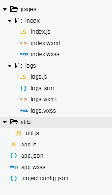

# WeChat
WeChat small program

## 网址
https://mp.weixin.qq.com/debug/wxadoc/dev/devtools/download.html

## 微信小程序与HTML5比较
* 相同点
   * 轻松跨平台。  
* 不同点
   * JavaScript限制：通过字符串传入来执行代码的能力都禁止了，与BOM相关的API都没有。
   * 登录方面：小程序通过wx.login获取code，避免登录前的重定向。
   * 存储方面：小程序用storage代替了HTML5中的localstorage、sessionstorage等。
   * 支付方面：微信支付路径不再受限制。
* 不足之处
  * 每个页面都需要手动在app.json中注册。
  * 打开页面有5个限制。

## 项目结构

总体结构：2个根目录（pages、utils）and 3个根文件（app.js、app.json、app.wxss）

（1）、 程序配置文件：固定不变

  app.js：小程序的逻辑文件，用来监听并处理小程序的生命周期函数，全局变量等
  
  app.json：主配置文件，对整个小程序的全局配置，配置小程序的页面组成，窗口背景，导航条样式等，不能添加任何注释
  
  app.wxss：整个小程序公共样式表，可根据需要修改或不使用
  
（2）、程序页面文件：根据需要增加

index.js：小程序的主页面，启动后首先执行

index.wxml：布局页面相当于html页面

index.wxss：样式表，决定wxml页面显示效果

logs.json：当前页面配置文件，只能配置windows配置项，以决定当前页面的表现

（3）、公共代码文件：util.js,存放公共的js代码，开发者可以根据需要添加其他目录（images）

（4）、日志文件：根据需要使用

